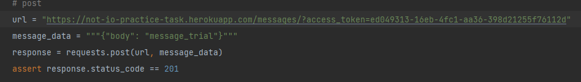

# da_practice_task_notif.io

## description
 The API basically works on link: https://not-io-practice-task.herokuapp.com/
 
 To open visual interface based on SWAGGER and Open API you should add /docs 
 to the root URL ( or click on this link https://not-io-practice-task.herokuapp.com/docs )
 
 The API is protected and uses API Key to authenticate those who have to have 
 access to number of features

 The key is provided here: ed049313-16eb-4fc1-aa36-398d21255f76112d
 ( in case you want to use it please make sure you paste it in the place specified bellow without 
  preceding and succeeding WHITESPACES ). 
 
 To access secured endpoints please provide the given key either within a header or specifying it in the
 URL. Examples:

        - Header: add such a header to your http request <access_token : [YOUR API KEY]>
        where instead of [YOUR API KEY] provide your API Key ( the key from the upper section for example  )
        
        - Query Parameter / URL: add your key to the end of your URL in your HTTP request as shown here
        https://not-io-practice-task.herokuapp.com/messages/[SOME_PARAMETER]?access_token=[YOUR_API_KEY]
        where instead of [YOUR_API_KEY] provide your API Key ( the key from the upper section for example )

        I prefere and recommend to use 'the header' method not to reveal the key in the URL.

Code example with the header:

Code example with URL:

In total there are 6 endpoints related to the API.

1. GET /messages  -  returns a list of all the messages and status code 200 (body and counter for every message). 
The counter of all the messages increases by 1 every time the method is called.

2. GET /messages/with-id  -  returns a list of all the messages with their IDs and status code 200 (id, body, counter for every message).
If the message exists, its counter is increased by 1 every time this message is retrieved by this method.

3. GET /messages/{id_message}  -  returns a message with a specified id and status code 200, or status code 404 with details if the message was not found
   (id, body for every message). If the message exists, its counter is increased by 1 every time this message is being retrieved by this method.
   

4. POST /messages  -  receives a message in JSON body; returns status code 201 and small notification about ID of the created message, or status code 400 in case format of input is wrong

5. PUT /messages/{id_message}  -  receives a message in JSON body and ID of the message to be modified in URL( query param ); returns
   status code 200 and some details along with the modified messages body in case the message was found and modified, otherwise returns status code 404.
   Also sets the counter of the message to 0.

6. DELETE /messages/{id_message}  -  simply takes id of a message, returns status code 204 in case message found and was deleted successfully,
   otherwise returns status code 404

## Specification

##### All the following examples are done using API Key in a header
 
1. GET /messages [UNSECURED]
      
    Link:  https://not-io-practice-task.herokuapp.com/messages
    
    METHOD: GET

    Returns: all the messages without their IDs in JSON Format along with status code 200 (if there are no messages, returns an empty list)
   
    Example response: [{"body":"11","counter":4},{"body":"Hello world","counter":8}]

 
2. GET /messages/with-id [UNSECURED]
      
    Link:   https://not-io-practice-task.herokuapp.com/messages/with-id
     
    METHOD: GET
   
    Return: the same as previous, but including IDs of the messages; returns status code 200 (if there are no messages, returns an empty list)

    Response example: [{"id_message":1,"body":"11","counter":6},{"id_message":2,"body":"How is the weather today?","counter":1},{"id_message":3,"body":"Night sky is such a mystery","counter":2}]
 
3. GET /messages/{id_message} [UNSECURED]
      
    Link: this link should be appended with the ID of the message you want to retrieve https://not-io-practice-task.herokuapp.com/messages

    METHOD: GET

    Returns: a single message in JSON along with status code 200, or status code 404 if the message was not found
  
    Request example: https://not-io-practice-task.herokuapp.com/messages/3

    Response example: {"body":"Night sky is such a mystery","counter":1} 
 
4. POST /messages [SECURED] ( needs authentication to impact the data )
returns status code 401 if user is not authenticated
     
    Link: https://not-io-practice-task.herokuapp.com/messages/

    METHOD: POST

    Accepts in body: POST request with JSON in body to add a new message. Format should be as follows
              {
                 "body" : "[YOUR MESSAGE]"
              }
              otherwise it will be rejected.
   
    Performs: validates the input and creates an instance of a message with a unique ID and its own counter
               if validation passed. Body should be between 1 and 160 characters. Otherwise returns status code 400

    Returns: status code 201 and a small piece of information about the recently created message

    Request example: {
                          "body" : "How is it going?"
                      }

    Response example:  "message with id 4 has been created"
 
5. PUT /messages/{id_message} [SECURED] ( needs authentication to impact the data ) 
   returns status code 401 if user is not authenticated
      
    Link: this link should be appended with ID of the message you want to update https://not-io-practice-task.herokuapp.com/messages/
    
    METHOD: PUT    

    Accepts in body: PUT request with JSON in body to update a message. Form should be as follows
                  {
                     "body" : "[YOUR_MESSAGE]"
                  }
                  otherwise it will be rejected.
   
    Performs: validates the input and updates the instance of a message with
               if validation passed. Body should be between 1 and 160 characters. Otherwise status code 400. Sets messages counter to zero.

    Returns: status code 200 and a small piece of information about the updated message, or status code 404 if message with the ID doesn't exist

    Request example: https://not-io-practice-task.herokuapp.com/messages/4
                      {
                          "body" : "Want some changes"
                      }

    Response example:  {"detail":"message with the id 4 has been modified","message":{"body":"Want some changes","counter":0}}
   

 
6.  DELETE /messages/{id_message} [SECURED] ( needs authentication to impact the data ) 
   returns status code 401 if user is not authenticated
      
    Link: this link should be appended with ID of the message you want to delete https://not-io-practice-task.herokuapp.com/messages/

    METHOD: PUT

    Returns: status code 204, or status code 404 if message with the message with the ID doesn't exist

    Request example: https://not-io-practice-task.herokuapp.com/messages/4

    Response example:  status code 204
    
## Consists of

All the related libraries are specified in requirements.txt in this repository.
There were used Python 3.8.5, tortoise-orm, pydantic, FastAPI, sqlite3.
For testing pytest library is used.
The database schema looks as follows:

## Deployment

The application is deployed on the Heroku hosting with free plan https://dashboard.heroku.com/.
This is why when you try to interact with the API, it takes a bit more time than usual.
That is why when you're addressing the link, the hosting runs the app ( normally it goes idle after some time ).
So to deploy app it connects to this git-hub repository and downloads the libraries specified in requirements.txt
along with code files. Afterwards it runs the taken code in accordance with options specified in Procfile.

###### Work is done by Adrian Chervinchuk 

